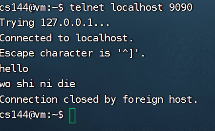

使用课程官方推荐的虚拟机环境，使用finals hell终端方便命令，设置了共享文件夹cs144lab，使用vscode远程连接操作，

查看是否成功共享文件夹

mount | grep vboxsf

手动设置共享文件夹

```
sudo mkdir -p /media/sf_cs144lab
```

```
sudo mount -t vboxsf -o rw,gid=vboxsf csl44lab /media/sf_cs144lab
#或者
sudo mount -t vboxsf cs144lab /media/sf_cs144lab
```

# 实验检查点0：网络热身

你的计算机上安装Linux，学习如何在互联网上执行一些任务，用C++编写一个小程序，在互联网上获取一个网页，并实现（在内存中）网络的一个关键抽象概念：一个可靠的字节流在写者和读者之间

执行两项任务的概念：检索网页和发送电子邮件.依赖于一种叫做可靠的双向字节流的网络抽象：你将在终端机上输入一串字节，同样的字节序列最终将以同样的顺序传递给另一台计算机（服务器）上运行的程序。服务器用它自己的字节序列进行响应，并传递回你的终端

## 获取网页


## 发送邮件

第一步：确定你的电脑与电子邮件服务器的关系。

下一步：谁在发送电子邮件

下一篇：谁是收件人

之后没有SUNid的邮箱，失败了,使用国内邮箱模拟


注意点：auth login，使用用户名，密码登录，且密码是设置邮箱开启POP3/SMTP服务后生成的授权密码，二者都输入的是base64编码的

## 接听和连接（Listening and connecting）

telnet是一个客户端程序，可以与其他计算机上运行的程序建立连接，本实验中，我们建立一个简单的服务器来等待客户端的连接




客户端与服务端处于连接状态，且可以通讯，在服务端结束，客户端也断开。

## 使用操作系统流套接字编写网络程序

[socket知识参考](https://blog.51cto.com/u_15073468/2794744#1_5)


写一个简短的程序，通过互联网获取一个网页。将利用操作系统提供的一个功能：在两个程序之间建立一个可靠的双向字节流，

即套接字。对你的程序和Web服务器来说，该套接字看起来就像一个普通的文件描述符（类似于磁盘上的一个文件，或者类似于stdin或stdout I/O流）。当两个流套接字连接在一起时，任何写入一个套接字的字节最终都会以同样的顺序从另一台计算机上的另一个套接字出来。

互联网并不提供可靠的字节流的服务。相反，互联网真正做的唯一事情是 "尽最大努力 "将短小的数据片断（称为互联网数据报）送到它们的目的地。每个数据报都包含一些元数据（报头）

通常情况下，连接两端的操作系统的工作是将 "尽力而为的数据报"变成 "可靠的字节流"。

## 可靠的内存字节流

将在一台计算机的内存中实现一个提供这种抽象的对象。

字节在 "输入 "端写入，并可按相同顺序从 "输出 "端读出。字节流是有限的：写入者可以结束输入，然后就不能再写入更多字节。当读取器读到字节流的末尾时，它将到达 "EOF"（文件末尾），不能再读取更多字节。

字节流也将受到流量控制，以限制其在任何给定时间的内存消耗。对象初始化时有一个特定的 "容量"：在任何给定时刻，它愿意存储在自己内存中的最大字节数。字节流将限制写入器在任何给定时刻的写入量，以确保字节流不会超出其存储容量。当读取器读取字节并从字节流中耗尽时，写入器可以写入更多字节。您的字节流是在单线程中使用的，您不必担心并发的写入/读出、锁定或竞赛条件。

字节流是有限的，但在写入器结束输入并完成流之前，它几乎可以任意长。您的实现必须能够处理比容量长很多的流。容量限制了在给定位置内存中的字节数（已写入但尚未读取），但不限制数据流的长度。只要写入器每次写入一个字节，并且读取器在允许写入器写入下一个字节之前读取每个字节，那么容量仅为一个字节的对象仍然可以承载长达数兆兆字节的数据流。

并实现一个提供该接口的对象

使用std::string_view来获取一个字符串的视图，字符串视图并不真正的创建或者拷贝字符串，而只是拥有一个字符串的查看功能。std::string_view比std::string的性能要高很多，因为每个std::string都独自拥有一份字符串的拷贝，而std::string_view只是记录了自己对应的字符串的指针和偏移位置。而std::string_view操作，从头到尾其实只有一个字符串数据，其它皆为视图。这也是需要注意的地方，因为std::string_view是原始字符串的视图，如果在查看std::string_view的同时修改了字符串，或者字符串被消毁，那么将是未定义的行为。**不熟悉，所以将有关string_view的使用注释掉了，使用最平常的string而已。**

出现一个bug以及解决过程看代码注释
