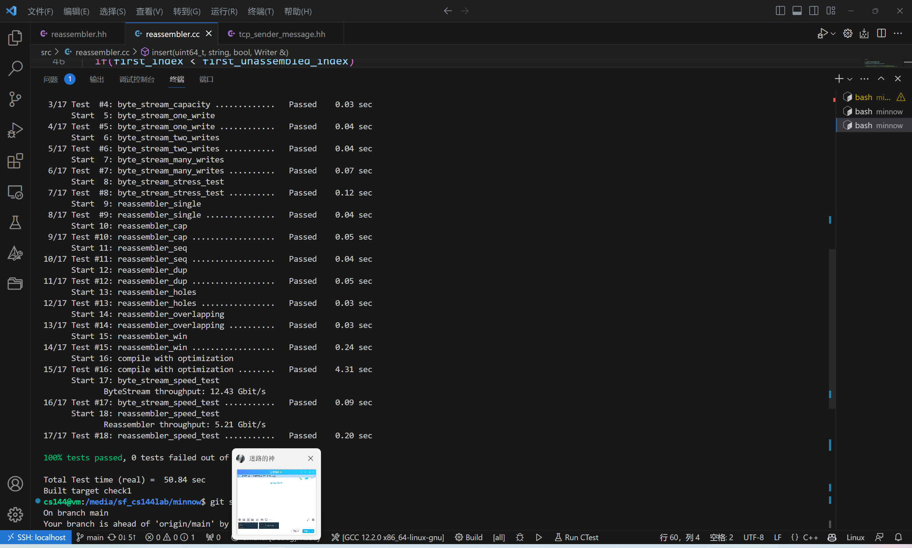
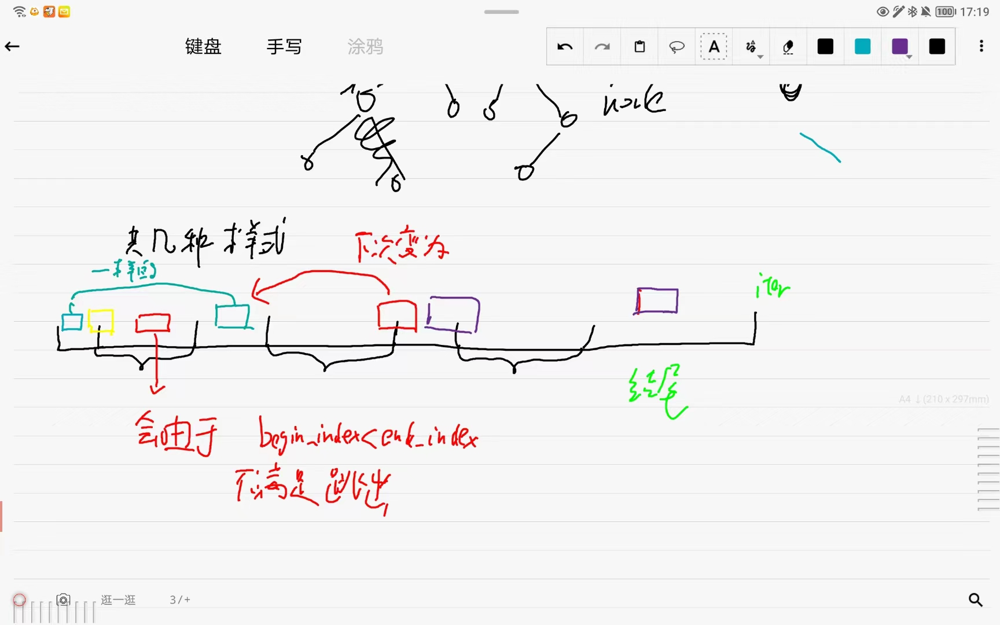

实验室检查点1：将子串拼接成字节流

在接下来的实验中，您将在网络上传输两个字节流：一个是 "出站 "字节流，用于本地应用程序写入套接字的数据，您的TCP将把这些数据发送给对等设备；另一个是 "入站 "字节流，用于本地应用程序读取来自对等设备的数据。

您的TCP实现将使用与您在Checkpoint 0中使用的相同的Minnow库，并添加额外的类和测试

## 开始

## 按顺序排列子串

在本实验和下一个实验中，你将实现一个TCP接收器：接收数据报并将其转换成可靠的字节流的模块，以便应用程序从套接字中读取--就像在Checkpoint 0中你的webget程序从webserver中读取字节流一样。

TCP发送方将其字节流划分成短段（每个子串不超过约1,460字节），使其适合于一个数据报。但网络可能会对这些数据报重新排序，或丢弃它们，或多次传送它们。接收方必须将这些据报段重新组合成最初的连续字节流。

在本实验中，您将编写负责重新组装的数据结构：Reassembler。它将接收由字节字符串组成的子串，以及该字符串在较大数据流中的第一个字节的索引。流中的每个字节都有自己唯一的索引，从0开始向上计数

TCP对重排和重复的健壮性来自于它能够将字节流的任意摘录拼接回原始流。在一个离散的可测试模块中实现这一点将使处理传入段变得更容易

reassembler.hh头文件中的Reassembler类描述了重装程序的完整（公共）接口。你的任务就是实现这个类。你可以在Reassembler类中添加任何你想要的私有成员和成员函数，但你不能改变它的公共接口

## 重装系统内部应该存储什么？

insert方法通知Reassembler关于ByteStream的一个新节选，以及它在整个流中的位置（子串开始的索引）。

原则上，重装系统必须处理三类知识：

流中的下一个字节。一旦知道这些字节，Reassembler应立即将其推送给Writer。

在数据流可用容量范围内但尚未写入的字节，因为较早的字节仍然未知。这些字节应该存储在Reassembler内部。

超出数据流可用容量的字节。这些字节应该被丢弃。重装程序不会存储任何无法立即推送到字节流中的字节，或者在已知更早的字节后立即推送到字节流中。

这种行为的目的是限制Reassembler和ByteStream使用的内存量，无论输入的子串是如何到达的。我们在下图中对此进行了说明。容量 "是两者的上限。

在重新组装的ByteStream中缓冲的字节数（绿色显示）

未组装 "子串可使用的字节数（红色显示）

应如何处理不一致的子串？ 您可以假设它们不存在。也就是说，您可以假设存在唯一的底层字节流，并且所有子串都是它的（准确）切片。

字节何时写入数据流？尽快。唯一不应该将字节写入数据流的情况是，在该字节之前有一个字节尚未被 "推送"。

我需要在Reassembler中添加私有成员吗？需要。子串可以以任何顺序到达，因此您的数据结构必须 "记住 "子串，直到它们准备好被放入流中--也就是说，直到它们之前的所有索引都被写入。

