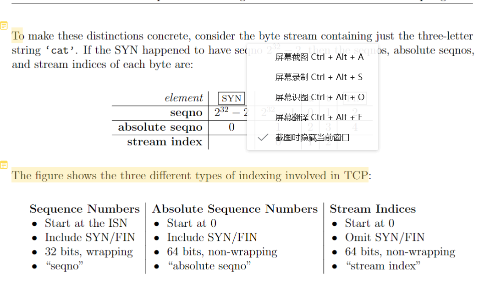
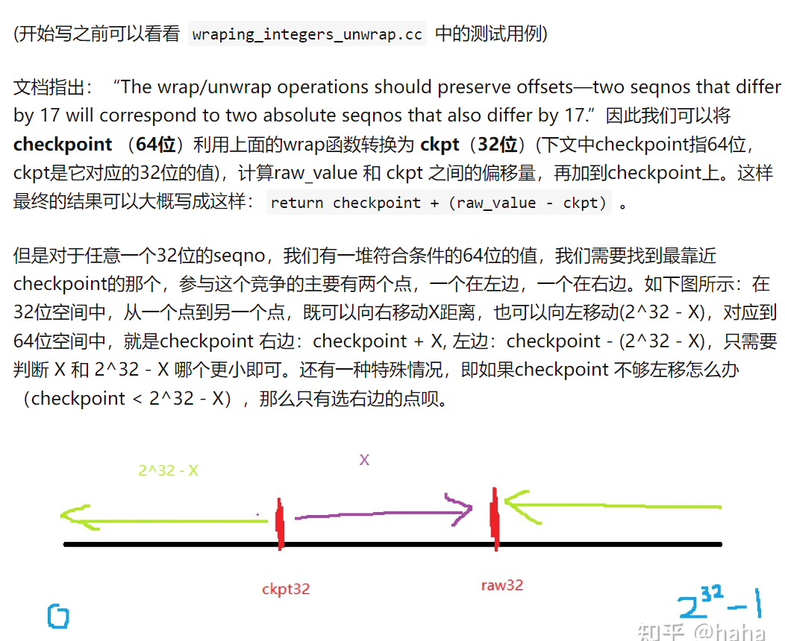
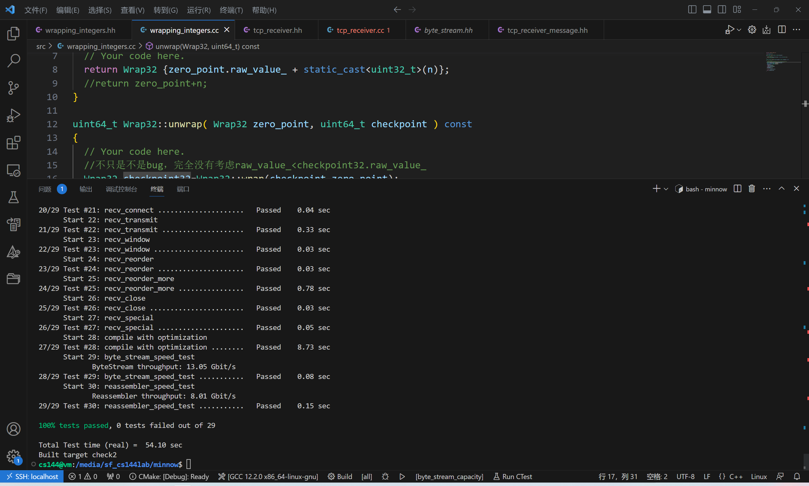

# Lab Checkpoint 2: the TCP receiver

在检查点2中，您将实现TCPReceiver，这是TCP实现中处理传入字节流的部分

TCPReceiver接收来自对等发送器的消息（通过receive()方法），并将其转换为对Reassembler的调用，最终写入传入的ByteStream中。 应用程序从该ByteStream中读取，就像在实验室0中通过从TCPSocket读取所做的那样。

与此同时，TCPReceiver还通过send()方法生成返回给对等发送方的消息。这些 "接收者消息 "负责告知发送者：

1.第一个未组装 "字节的索引，称为 "确认号码 "或 "ackno"。这是接收方需要从发送方获得的第一个字节。

2.输出字节流的可用容量。这被称为 "窗口大小"。

ackno和窗口大小共同描述了接收方的窗口：允许TCP发送方发送的索引范围。利用窗口，接收方可以控制传入数据的流量，使发送方限制其发送量，直到接收方准备好接收更多数据。我们有时将ackno称为窗口的 "左边缘"（TCPR接收方感兴趣的最小索引），将ackno + 窗口大小称为 "右边缘"（刚好超过TCPR接收方感兴趣的最大索引）。

## 思考TCP将如何表示每个字节在数据流中的位置--即 "序列号"。

本周，您将实现TCP的 "接收器 "部分，负责接收来自发送者的报文，重新组装字节流（包括发生时的结束），并确定应发送回发送者以进行确认和流控制的报文。

这些信号对于TCP在不可靠的数据报网络上提供流量控制的、可靠的字节流服务的能力至关重要。 在TCP中，确认意味着 "接收方需要的下一个字节的索引是什么，以便它能够重新组装更多的字节流？这就告诉发送方需要发送或重新发送哪些字节。流量控制意味着 "接收方感兴趣并愿意接收的索引范围是多少？(这是其可用容量的函数）。这告诉发送方允许发送多少字节。

## 64位索引和32位序列之间的转换

实现需要为32位整数进行包装

TCP中的数据流可以任意长--通过TCP发送的字节流长度没有限制。但是2^32字节只有4GiB，并不算大。一旦32位序列号数到2^32 - 1，流中的下一个字节的序列号将为0。

TCP序列号从一个随机值开始：为了提高稳健性，避免被属于同一端点之间早期连接的旧网段所混淆，TCP试图确保序列号无法被猜出，并且不太可能重复。因此，数据流的序列号不是从零开始的。数据流中的第一个序列号是一个32位的随机数，称为初始序列号（ISN）。这个序列号代表 "零点 "或SYN（数据流的开始）。在此之后，其余的序列号将正常工作：第一个数据字节的序列号为ISN+1（mod 232），第二个数据字节的序列号为ISN+2（mod 232），等等。

TCP 是一种协议，可确保通过网络可靠地传输数据。 -除了确保接收所有字节的数据外，TCP 还确保可靠地接收流的开头和结尾。 -流的逻辑开头和结尾各占用一个序列号。 -TCP 为 SYN（流开始）和 FIN（流尾）控制标志分配序列号。 -SYN 标志代表字节流的开头，FIN 标志代表字节流的结尾。 -这些标志中的每一个都占据一个序列号。 -需要注意的是，SYN 和 FIN 不是流本身的一部分，也不被视为 “字节”。 -数据流中的每个字节也占用一个序列号。 -SYN 标志占用的序列号称为初始序列号 (ISN)。 -ISN 是随机生成的数字，用于防止对 TCP 连接的某些类型的攻击。 -通过为流的开头和结尾分配序列号，TCP 可确保数据以正确的顺序可靠地传输

序列号用于跟踪 TCP 连接中两个端点之间传输的数据段的顺序。 -每个 TCP 数据段都包含一个包含序列号的标头，该序列号用于识别数据段在传输的数据流中的位置。 -TCP 连接中有两个独立的流，每个方向一个，每个流都有自己的序列号。 -为确保序列号不可预测并防止攻击，每个直播均使用随机初始序列号 (ISN)。 -还提到了 “绝对序列号” 的概念，它指的是始终从零开始且不环绕的序列号。 -这与 TCP 数据段中使用的序列号不同，后者在达到最大值后可以换行。 -最后，引入了 “流索引” 的概念，它本质上是正在传输的数据流中每个字节的索引，从零开始。 -此流索引是 Checkpoint 1 中实现的 Reassembler 模块所使用的索引，用于跟踪传入数据段的顺序并将其重组到原始流中。

TCPReceiverMessage结构包含了从TCP接收方发送到发送方的信息。
*包含两个字段:

* 1)确认号(ackno): TCP接收方需要的下一个序列号。这是一个可选字段，如果tcreceiver还没有接收到初始序列号，则该字段为空。
* 2)窗口大小。这是TCP接收方有兴趣接收的序列号的数量，从存在的确认号开始。最大值是65,535(头部的UINT16_MAX)。

tcpsendmessage结构包含从TCP发送方发送到接收方的信息。它包含四个字段:
1）段开头的序号(seqno)。如果设置了SYN标志，则表示SYN标志的序列号。否则，它就是负载开头的序列号。

2）SYN标志。如果设置，则意味着该段是字节流的开始，并且seqno字段包含初始序列号(ISN)——零点。
3）负载:字节流的子字符串(可能为空)。

4）FIN旗。如果设置，则表示有效负载表示字节流的结束。

