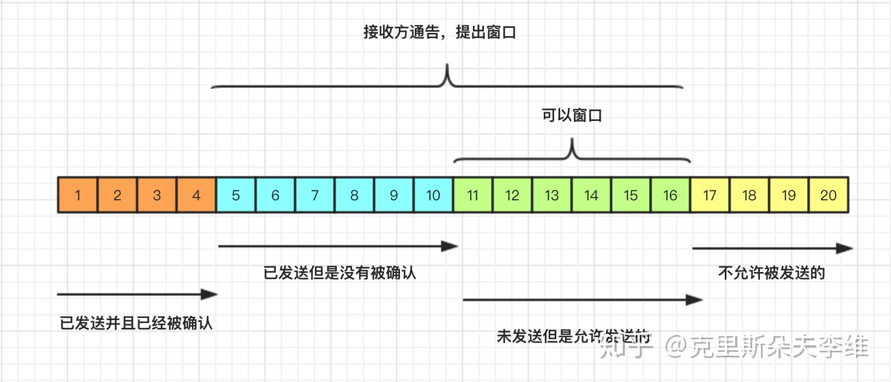
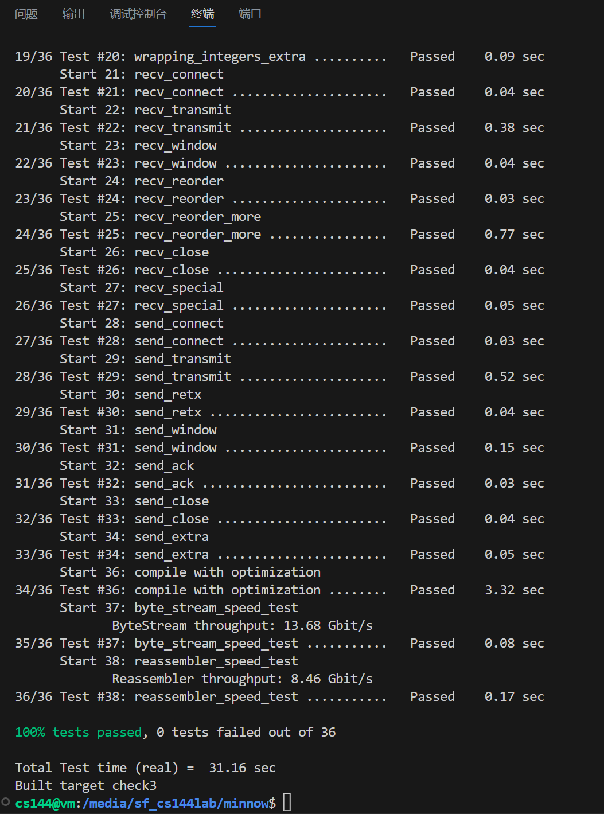

# Lab Checkpoint 3: the TCP sender

将实现TCP的 "发送方 "部分，负责读取字节流（由某个发送方应用程序创建和写入），并将字节流转化为一连串的发送TCP段。

## 您的 TCPSender 有责任

1.跟踪接收方的窗口（接收传入的TCPReceiverMessage及其acknos和窗口大小）

2.通过读取字节流、创建新的TCP段（如果需要，包括SYN和FIN标志）并发送它们，尽可能填满窗口。发送方应不断发送段，直到窗口已满或出站字节流已无其他段可发送。

3.跟踪已发送但接收方尚未确认的数据段，我们称之为 "未确认 "数据段。

4.如果已发送的片段已过了足够的时间，但仍未得到确认，则重新发送未完成的片段

其基本原理是发送接收方允许我们发送的任何内容（填满窗口），并不断重发，直到接收方确认每个网段。这被称为 "自动重复请求"（ARQ）。由于您上周的工作，我们知道远程TCP接收机可以重建字节流，只要它至少接收到一次每个索引标记的字节--无论顺序如何。发送方的工作就是确保接收方至少收到一次每个字节。

## 需要记录什么

1. TCPSender如果之前没有发送过SYN，那么就需要发送它。如果没有要发的数据了并且数据流已关闭了，表示发送结束，此时如果还有空间可以传输的话，就要带上FIN（空间不够的话就下一个包发送）。所以应当要知道有没有发送过FIN和SYN，我用布尔类型的syn_和fin_来记录
2. TCPSender在接收确认信息时，会有一个对面的窗口大小，发送的数据不能超过这个窗口大小，所以这里需要记录一下窗口的大小，这里我用 window_size_ 变量来记录
3. 重传次数，用retransmissions_num_来记录
4. 接收到对方返回的数据时有一个索引号，这个索引号表示对方下一次希望收到的数据的索引号，也代表之前的数据都没有问题。用recv_seqno_表示。发送方发送数据时，下一个要发的数据索引你也需要知道，所以应当记录一下发送方下次打算要发的数据索引号，我用next_seqno_表示
5. 已发送未确认的数据大小。sequence_numbers_in_flight() 函数需要你返回这个数值，所以也必须要记录一下,这里用outstanding_bytes_表示
6. 要发送的报文段和已发送未确认的报文段。我用messages_和outstanding_messages_表示。

## TCPSender 如何知道是否丢失了一个网段

-TcpSender 负责通过网络发送数据段。 -发送分段后，TcpSender 会一直对其进行跟踪，直到收到接收方已收到该分段的确认。 -TcpSender 会定期检查已发送的数据段是否长时间未得到确认。 -如果长时间未确认分段，TcpSender 会重新传输该分段以确保接收方收到该分段。 -TcpSender 使用 tick 方法来指示时间的流逝，并检查是否需要重新传输任何数据段。 -tcpSender 保留了一系列未完成的 tcpSenderMessages，其中包括所有已发送但尚未确认的片段。 -TcpSender 会检查集合中发送时间最早的片段，看看它是否在没有得到确认的情况下未处理了太长时间。 -如果长时间未确认最早发送的数据段，TcpSender 会重新传输该分段以确保接收方收到该分段。

实现"未偿时间过长 "的规定

1.每隔几毫秒，您的TCPSender的tick方法就会被调用一次，并带有一个参数，告诉它自上次调用该方法以来已经过去了多少毫秒。用它来保持TCPSender活着的总毫秒数。

2.当构建TCPSender时，会给它一个参数，告诉它重传超时（RTO）的 "初始值"。RTO 是重新发送未完成的 TCP 网段前的等待毫秒数。随着时间的推移，RTO的值会发生变化，但 "初始值 "保持不变。启动代码将 RTO 的 "初始值 "保存在一个名为 initial retransmission timeout（初始重传超时）的成员变量中。

3.您将实现重传定时器：一个可以在特定时间启动的警报，一旦RTO过去，警报就会关闭（或 "过期"）。我们强调时间流逝的概念来自于调用的tick方法，而不是通过获取一天中的实际时间。

4.每次发送包含数据（在序列空间中长度不为零）的数据段时（无论是首次发送还是重发），如果定时器没有运行，则启动它，使其在RTO毫秒后过期（对于当前的RTO值）。 所谓 "过期"，是指时间将在未来的某个毫秒数耗尽。

5.当所有未完成的数据被确认后，停止重传计时器

6.如果调用tick并且重传计时器已过期

a.重发尚未被TCP接收方完全确认的最早（序列号最低）的数据段。您需要在某种内部数据结构中存储未确认的数据段，以便能够做到这一点。

b.如果窗口大小不为零

​	跟踪连续重传的次数，并因为您刚刚重传了一些东西而递增它。您的TCPConnection将使用该信息来决定连接是否无望（连续重传次数过多），是否需要中止。

​	RTO值加倍。这就是所谓的 "指数回退"--它减缓了糟糕网络的重传速度，以避免进一步堵塞网络。

c.重置重传定时器，并使其在RTO毫秒后过期（考虑到您可能刚刚将RTO值增加了一倍！）。

7.当接收方给发送方一个ackno，确认成功接收到新数据时（ackno反映的绝对序列号大于之前的任何ackno）

​	a.将RTO调回 "初始值"。

​	b.如果发送方有任何未处理的数据，则重启重传定时器，使其在 RTO 毫秒（RTO 的当前值）后过期。

​	c.将“连续重传”的计数重置为零。

## 实现TCP发送器

TCPSender提供具体接口。它需要处理五个重要事件：

### void push( Reader& outbound stream );

TCPSender被要求从出站（outbound）字节流中填充窗口：它从字节流中读取并生成尽可能多的TCPSenderMessage，只要有新的字节被读取并且窗口中有可用空间。

您需要确保您发送的每一条TCPSenderMessage都完全适合接收者的窗口。使每条消息尽可能大，但不能大于TCPConfig::MAX PAYLOAD SIZE（1452字节）给出的值。

您可以使用 TCPSenderMessage::sequence length() 方法来计算段所占用的序列号总数。请记住，SYN和FIN标志也各占用一个序列号，这意味着它们占用了窗口中的空间。

如果窗口大小为零，我该怎么办？如果接收方宣布窗口大小为0，推送方法应该假装窗口大小为1。发送方最终发送的单字节可能会被接收方拒绝（不确认），但这也会引起接收方发送一个新的确认段，在这个段中，接收方会显示在其窗口中打开了更多的空间。如果没有这样做，发送方永远不会知道它被允许重新开始发送。

这是您的实现在窗口大小为零时的唯一特殊情况。TCPSender实际上不应该记住一个错误的窗口大小为1。另外，请注意，即使窗口大小为1，窗口仍然可能是满的。

### 滑动窗口

滑动窗口机制是TCP的一种流量控制方法，该机制允许发送方在停止并等待确认前连续发送多个分组，而不必每发送一个分组就停下来等待确认，从而增加数据传输的速率提高应用的吞吐量。

### 

TCP的包可以分为四种状态

- 已发送并且已经确认的包。
- 已发送但是没有确认的包。
- 未发送但是可以发送的包。
- 不允许被发送的包。

### std::optional< TCPSenderMessage > maybe_send();

这是TCPSender实际发送tcpsendmessage(如果它想的话)的机会。

### void receive( const TCPReceiverMessage& msg );

从接收方收到一条消息，传递窗口新的左边缘（=ackno）和右边缘（=ackno + 窗口大小）。TCPS发送方应查看其收集的未完成段，并删除任何现在已完全确认的段(ackno大于段中的所有序列号)

### void tick( const size t ms since last tick );

时间已过 - 自上次调用本方法以来的一定毫秒数。发送方可能需要重新发送未完成的数据段。

### void send_empty_message():

TCPSender应生成并发送正确设置了序列号的零长报文。如果对等方要发送 TCPReceiverMessage（例如，因为它需要确认来自对等方发送方的内容），并且需要生成一个 TCPSenderMessage 与之匹配，那么这将非常有用。

如何 "发送 "信息

当调用 maybe_send() 时返回

我是否应该在 "未完成 "数据结构中存储空段，并在必要时重新传输它们？

否 - 只有那些传输特定数据（即占用一定长度的序列空间）的网段才应记忆为未传输，并可重新传输。不占用序列号的网段（无有效载荷、SYN或FIN）无需记忆或重传。

