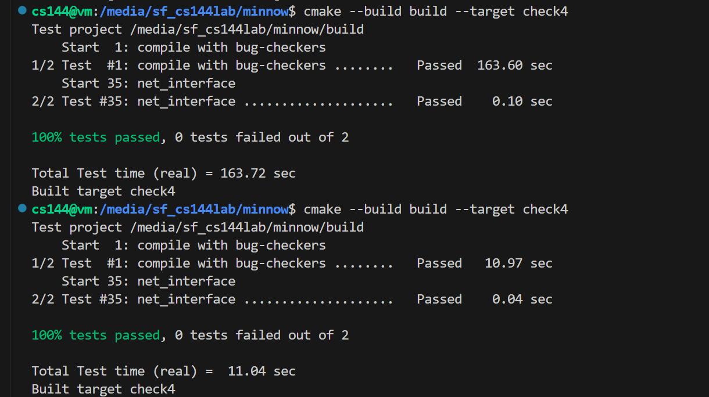

# Lab Checkpoint 4: down the stack (the network interface)

## 本周的实验涉及实现一个名为桥接的网络接口。 

-网桥充当 Internet 数据报和链路层以太网帧之间的连接。 -Internet 数据报是通过互联网传输的数据包，而以太网帧是在本地网络内传输的数据包。 -桥接组件可以放置在早期实验的 TCP/IP 实现的 “下方”，这意味着它可以集成到现有的网络架构中。 -桥接组件也将在不同的设置中使用，尤其是在实验 6 中构建路由器时。 -在路由器环境中，网桥组件将在网络接口之间路由数据报。

在过去的实验中，您编写了一个TCP实现，它可以与任何其他使用TCP的计算机交换TCP段。**这些网段究竟是如何传送给对等方的 TCP 实现的？有以下几种选择：**

### TCP-in-UDP-in-IP

TCP段可以在用户数据报的有效载荷中携带。在正常(用户空间)设置中工作时，这是最容易实现的:Linux提供了一个接口(“数据报套接字”，UDPSocket)，它**允许应用程序只提供用户数据报的有效载荷和目标地址，内核负责构造UDP报头、IP报头和以太网报头，**然后将数据包发送到适当的下一跳。内核确保每个套接字都有本地和远程地址及端口号的独家组合，由于内核是将这些地址和端口号写入 UDP 和 IP 头的人，因此可以保证不同应用程序之间的隔离。

### TCP-in-IP

在常用情况下，TCP 报文段几乎总是直接放在互联网数据报内，在 IP 报文头和 TCP 报文头之间没有 UDP 报文头。这就是人们所说的“TCP/IP”。这一点实施起来比较困难。Linux 提供了一个名为 TUN 设备的接口，**它允许应用程序提供整个互联网数据报，内核则负责其他部分（编写以太网报头、通过物理以太网卡实际发送等）。但是现在应用程序必须自己构造完整的IP报头，而不仅仅是有效负载。**

### TCP-in-IP-in-Ethernet

在上述方法中，我们仍然依赖Linux内核来实现部分网络堆栈。每当你的代码向 TUN 设备写入一个 IP 数据报时，Linux 就必须以 IP 数据报为有效载荷构建一个适当的链路层（以太网）帧。这意味着 Linux 必须根据下一跳的 IP 地址，找出下一跳的以太网目标地址。**如果它还不知道这个映射，Linux会广播一个查询:“谁声明了下面的IP地址?”你的以太网地址是什么?，然后等待回复。**

**这些功能由网络接口执行:一个将出站IP数据报转换为链路层(例如，以太网)帧的组件，反之亦然。**(在实际系统中，网络接口通常有eth0、eth1、wlan0等名称)

在本周的实验中，你将实现一个网络接口，并将其置于 TCP/IP 协议栈的最底层。**您的代码将生成原始以太网帧，这些帧将通过称为TAP设备的接口传递给Linux——TAP设备类似于TUN设备**，但层次更低，因为它交换原始链路层帧，而不是IP数据报。

大部分工作是**为每个下一跳 IP 地址查找（和缓存）以太网地址**。   这方面的协议称为地址解析协议，或 ARP。

我们已经为您提供了单元测试，让您的网络接口通过测试。在实验 6 中，你将在 TCP 环境之外使用相同的网络接口，作为 IP 路由器的一部分。

## Checkpoint 4: The Address Resolution Protocol

本实验室的主要任务是实现 NetworkInterface 的三个主要方法（network interface.cc文件中），维护 IP 地址到以太网地址的映射。**映射是一个缓存，或“软状态”:NetworkInterface为了提高效率而保留它，但如果必须从头开始，映射自然会重新生成，而不会引起问题**

### send_datagram

当调用方（如您的 TCPConnection 或路由器）希望向下一跳发送出站互联网 (IP) 数据报时，就会调用该方法。接口的工作就是将数据报转换成以太网帧，并（最终）发送出去。

​	如果已知道目标以太网地址，则立即发送,创建以太网帧（类型 = EthernetHeader::TYPE IPv4），将有效载荷设置为序列化数据报，并设置源地址和目标地址。

​	如果目的以太网地址未知,广播 ARP 请求，获取下一跳的以太网地址，**并对 IP 数据报进行排队**，以便在收到 ARP 回复后再发送

​	**您不希望ARP请求充斥整个网络。如果网络接口在最近5秒内已经发送了一个关于同一IP地址的ARP请求，不要发送第二次请求-等待第一个的回复**.同样，将数据报排成队列，直到得知目标以太网地址

### recv_frame

**当以太网帧从网络到达时调用此方法**。代码应忽略任何不以网络接口为目标的帧（也就是说，**以太网目标地址要么是广播地址，要么是存储在以太网地址成员变量中的接口自身以太网地址**）。

- 该方法通过检查帧的以太网目的地址来实现这一点。
- 如果目的地址是广播地址，则表示该帧适用于网络上的所有设备，应进行处理。
- 如果目的地址与网络接口的以太网地址相匹配，则表示该帧是针对该特定接口的，应进行处理。
- 但是，如果目的地址与上述任一条件都不匹配，则表示该帧不适用于网络接口，应将其忽略。

​	如果入站帧是 IPv4，则将有效载荷解析为 InternetDatagram，如果成功（即parse()方法返回 true），则将生成的 InternetDatagram 返回给调用者。

​	如果入站帧是 ARP，则将有效载荷解析为 ARPMessage，如果成功，则在 30 秒内记住发送方 IP 地址和以太网地址之间的映射。(此外，如果是询问我们 IP 地址的 ARP 请求，则发送适当的 ARP 回复。

### maybe_send

这是 NetworkInterface 发送 EthernetFrame 的机会（如果它愿意的话）。

### tick

这就是所谓的时间流逝。过期 IP 到以太网映射。

## Q&A

如何 "发送 "以太网帧？

调用 send() 时返回

我应该使用什么数据结构来记录下一跳 IP 地址和以太网地址之间的映射关系？Up to you

如何将address对象形式的 IP 地址转换为可写入 ARP 报文的原始 32 位整数？

Use the Address::ipv4_numeric() method

如果 NetworkInterface 发送 ARP 请求但从未收到回复，该怎么办？我是否应该在超时后重新发送？使用 ICMP 向原始发送者发出错误信号？

在现实生活中，这两件事都会发生，但在本实验室中不用担心。(在现实生活中，如果接口无法收到 ARP 请求的回复，最终会通过互联网向原始发送者发送 ICMP "主机不可达"）。

如果 InternetDatagram 正在排队等待了解下一跳的以太网地址，但该信息从未出现，该怎么办？是否应该在超时后丢弃数据报？

在现实生活中肯定是肯定的，但在这个实验中不用担心

How do parse() and serialize() work?

parse()接受一个T& obj和一个vector& buffers。如果成功，它将用结果填充obj并返回true。否则，返回false。

serialize()接受一个T& obj类型，并以vector< Buffer>的形式返回结果。

[cs144-sp23, Lab Checkpoint 4: down the stack (the network interface) - 一只豆腐 (hangx-ma.github.io)](https://hangx-ma.github.io/2023/05/27/cs144-lab4.html)

