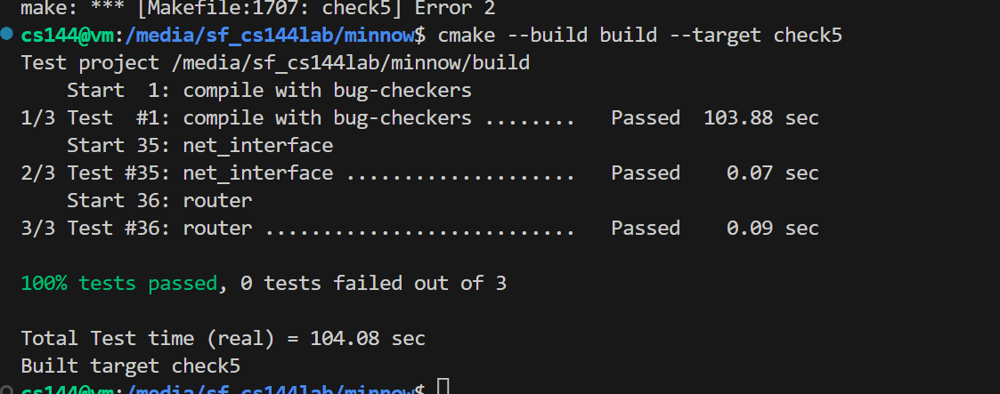

# 构建 IP 路由器

在本周的实验检查点中，你将在现有的 NetworkInterface 上实现一个 IP 路由器。路由器有多个网络接口，可以接收任何一个接口上的互联网数据。路由器的工作是根据路由表转发收到的数据报，路由表是一个规则列表，它告诉路由器，对于任何给定的数据报:

•用什么接口发送
•下一跳IP地址

**你的任务是实现一个路由器，它能为任何给定的数据报找出这两点。**(不需要实现生成路由表的算法，例如RIP、OSPF、BGP或SDN控制器，只需要实现遵循路由表的算法。)

路由器的实现将使用 Minnow 库中的Router类，以及在模拟网络中检查路由器功能的测试。

检查点 5 基于检查点 4 中 NetworkInterface 的实现，但不使用之前实现的 TCP 栈。IP路由器不需要了解TCP、ARP或以太网(只需要了解IP)。

路由器包含多个网络接口，可以在任何一个接口上接收 IP 数据报。路由器会将收到的数据报转发到相应出站接口上的下一跳。路由表告诉路由器如何做出这一决定

## 实施路由器

在本实验中，您将实现一个Router类，它可以

•跟踪路由表(转发规则或路由的列表)，以及
•转发它接收到的每个数据报;
-到正确的下一跳
-配置正确的出接口

你的实现将被添加到 router.hh 和 router.cc 骨架文件中。在开始编码之前，请查看 router.hh 中新 Router 类的文档。在本实验中，用户将实现一个具有两个主要功能的 Router 类。在本实验中，用户将实现一个具有两个主要功能的 Router 类。

第一个功能是跟踪路由表，它本质上是转发规则或路由的列表。此路由表将告诉路由器将收到的每个数据报转发到哪里。

Router 类的第二个功能是将其接收到的每个数据报转发到正确的下一跳和正确的传出 NetworkInterface 上。这意味着路由器需要使用路由表来确定其接收到的每个数据报的相应下一跳和传出接口。

## add_route

该方法将路由添加到路由表中。你需要在 Router 类中添加一个数据结构作为私有成员来存储这些信息。本方法只需保存路由供以后使用。

### 路线各部分的含义是什么？

路由是指导路由器如何转发数据报的规则。 -这是一个 “匹配操作” 规则，这意味着它匹配特定条件，然后采取特定的操作。 -路由匹配的条件是数据报前往特定网络（定义为 IP 地址范围）。 -如果选择该路由作为最具体的匹配路由，则路由器应将数据报转发到特定接口上的特定下一跳。 -“最具体的匹配路由” 表示应选择与数据报的目标 IP 地址最接近的路由。 -“下一跳” 是数据报应转发到的下一个路由器或目的地的 IP 地址。 -“接口” 是应通过其转发数据报的物理或逻辑连接。

 -“匹配” 是指数据报是否流向特定网络。 -为确定这一点，路由器使用路由表中指定的路由前缀和前缀长度。 -路由前缀是一个 32 位数字 IP 地址，用于指定可能包括数据报目的地的 IP 地址范围（网络）。 -前缀长度是介于 0 到 32（含）之间的数字，它告诉路由器路由前缀中有多少位有意义。

-**如果路由器直接连接到网络，则数据报的目的地址是下一跳，无需涉及其他路由器。 -但是，如果路由器需要通过另一台路由器才能到达目的网络，则下一跳将是该路由器的 IP 地址，并且需要使用相应的接口将数据报发送到该路由器**

## route()

此方法需要将每个传入数据报路由到下一跳，从适当的接口发出。它需要实现IP路由器的“最长前缀匹配”逻辑，以找到最佳路由。这意味着

路由器在路由表中查找与数据报的目的地址匹配的路由。通过“匹配”，我们的意思是目的地址的最高有效前缀长度位与路由前缀的最高有效前缀长度位相同

在匹配的路由中，路由器选择前缀长度值最大的路由。这是最长的前缀匹配路由。

如果没有匹配的路由，路由器就会丢弃数据报

路由器会递减数据报的 TTL（生存时间）。如果 TTL 已为零，或在递减后为零，路由器应丢弃该数据报

否则，路由器会将修改后的数据报通过相应的接口（interface(interface num).send datagram() ）发送到相应的下一跳。

## 问题

### 我应该使用什么数据结构来记录路由表？

由你决定！但没必要这么疯狂。每个数据报需要 O(N ) 次工作是完全可以接受的，其中 N 是路由表中的条目数。如果你想做得更有效率，我们建议你在优化之前先获得一个可行的实现，并仔细记录和注释你选择实现的任何功能。

### 如何将地址对象形式的 IP 地址转换为可写入 ARP 报文的原始 32 位整数？

Use the Address::ipv4 numeric() method

### 如何将一个 32 位 IP 地址的最重要 N 位（0 ≤ N ≤ 32）与另一个 32 位 IP 地址的最重要 N 位进行比较？

### 如果路由器没有通往目的地的路由，或者 TTL 为零，它难道不应该向数据报的源发送 ICMP 错误消息吗？

在现实生活中，是的，这很有帮助。但在本实验室中并非必要--丢弃数据报就足够了。

