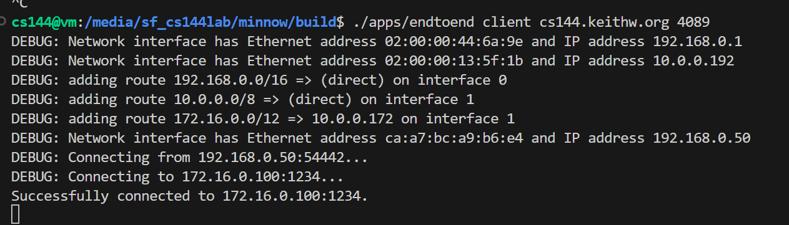

# 检查点 6：统筹安排

**（本人似乎有个bug，在连接测试中，关闭连接时，server没有问题，但是client没到最后，但是文件传输没有问题）**

在这个可选检查点中，您不需要进行任何编码（假设您之前的检查点处于合理的工作状态）。为了圆满完成任务，您将使用之前的所有实验来创建一个真实的网络，其中包括您的网络协议栈（主机和路由器）与班上另一位同学实现的网络协议栈进行对话。

## The Network

在本实验中，您将创建一个真实网络，将您的网络协议栈与班上另一位同学的网络协议栈结合起来。你们每人将贡献一台主机（包括可靠的字节流、TCP 实现和 NetworkInterface）和一个路由器：

由于您或您的实验伙伴很可能位于网络地址转换器之后，因此双方之间的网络连接将通过中继服务器（cs144.keithw.org）进行。

我们已将您的代码粘合到一个新的应用程序中，您可以在 build/apps/endtoend 中找到该程序。 以下是运行该程序的步骤

1. 在与实验伙伴一起执行这些步骤之前，请先自己尝试一下。您可以在虚拟机上使用两个不同的窗口或终端，同时扮演客户端和服务器这两个角色。 这样，您的网络中就会有两份代码（主机和路由器）在自说自话。这比与陌生人对话更容易调试！

2. 要使用中继器，请在 1024 和 64000 之间随机选择一个偶数。在接下来的示例中，我们假设你选择了 "3000"：

3. 在 "build "目录下，运行 "服务器 "学生： ./apps/endtoend server cs144.keithw.org 3000（将 "3000 "替换为实际数字）。 如果一切顺利，"服务器 "将打印如下输出：

4. 在 "build"目录下，"客户端 "学生将运行： ./apps/endtoend client cs144.keithw.org 3001（将 "3001 "替换为随机数，加一）。 如果一切顺利，"客户端 "将打印出如下输出：

5. 如果你看到了预期的输出结果，那就说明两台计算机已经成功交换了 TCP 协议握手！

6. 如果没有看到预期的输出，可能就需要开启 "调试模式 "了。 运行 "endtoend "程序，并在命令行末尾添加一个参数："debug"。这将打印出正在交换的每个以太网帧，你可以看到所有的 ARP 和 TCP/IP 帧。

7. 在自己的电脑上实现两个窗口之间的网络连接后，就可以与实验伙伴（以及他们自己的实施方案）尝试相同的步骤了。

## Sending a file

一旦看起来可以进行基本对话，就可以尝试通过网络发送文件。 同样，您可以自己尝试，如果一切顺利，再与实验伙伴一起尝试。具体方法如下：

将一个1m大小的随机文件写入" /tmp/big.txt ":
dd if=/dev/urandom bs=1M count=1 of=/tmp/big.txt
让服务器在接收到连接后立即发送文件:
./apps/endtoend server cs144.keithw.org偶数< /tmp/big.txt
要让客户端关闭其出站流并下载文件:
</dev/null ./apps/endtoend client cs144.keithw.org奇数> /tmp/big-received.txt
比较两个文件并确保它们是相同的:
Sha256sum /tmp/big.txt或Sha256sum /tmp/big-received.txt
如果SHA-256哈希匹配，您几乎可以肯定文件传输正确。

